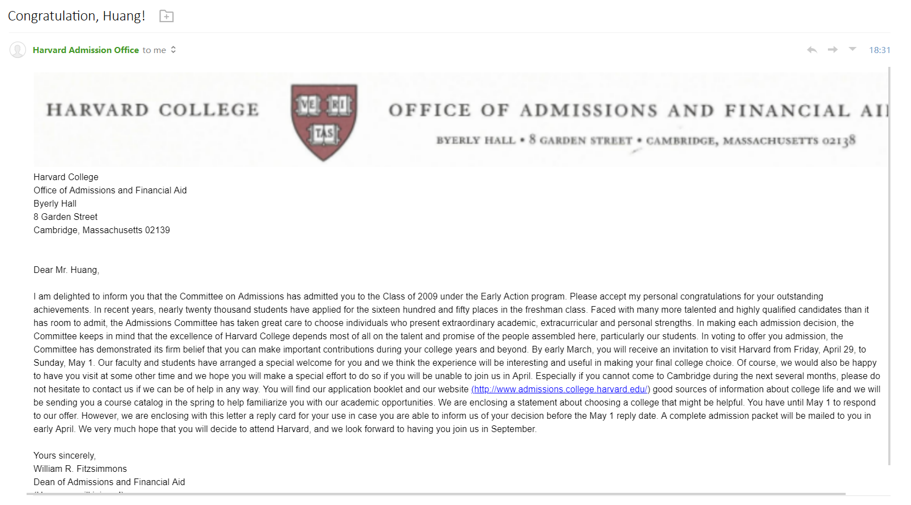
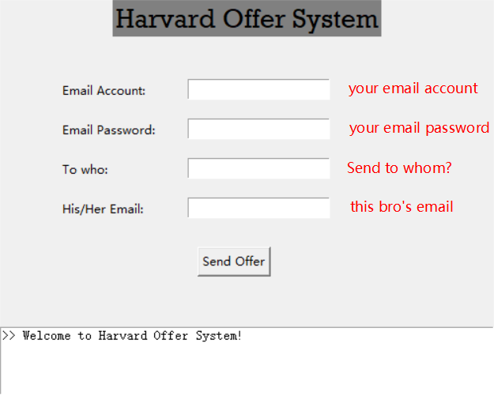

HARVARD OFFER SYSTEM

---

Pretend you get the offer from Harvard, the effect can be viewed below:

## How to use

Just run the `harvard offer system.exe` or `core.py` (if you have python). And fill the information in Entry box:

Then, click <kbd>send offer</kbd>. It will be OK

## Warning

I am lazy. Hence this tool only support [163 Mail](https://mail.163.com/) with STMP open. But if you want to use the email from other service. Just modified the STMP part in source code; believe me, it is simple!

